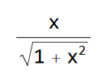
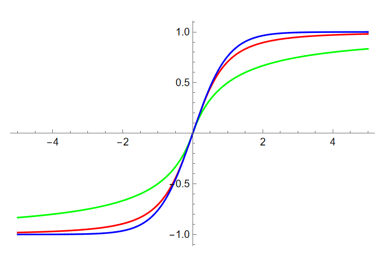
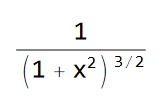
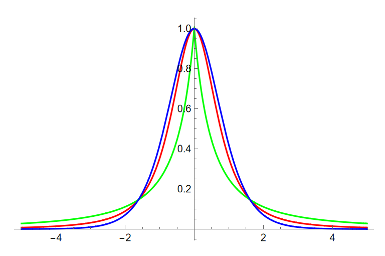
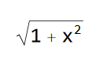
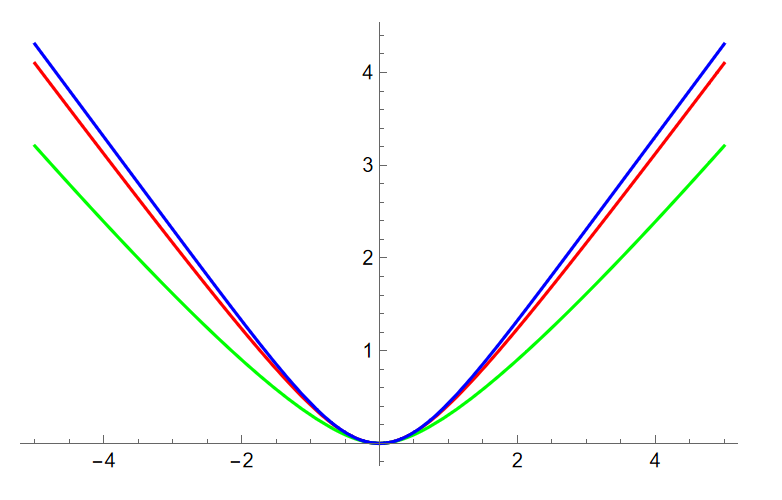
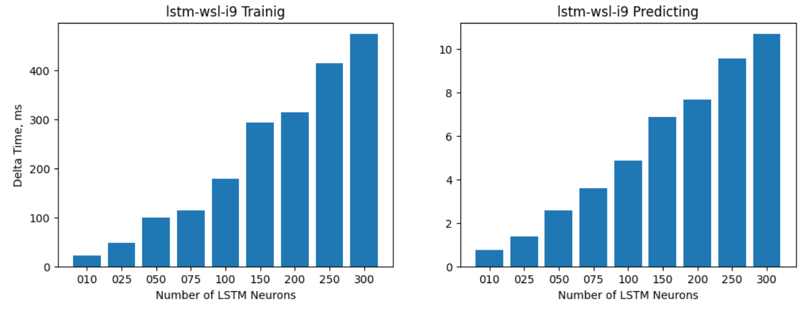
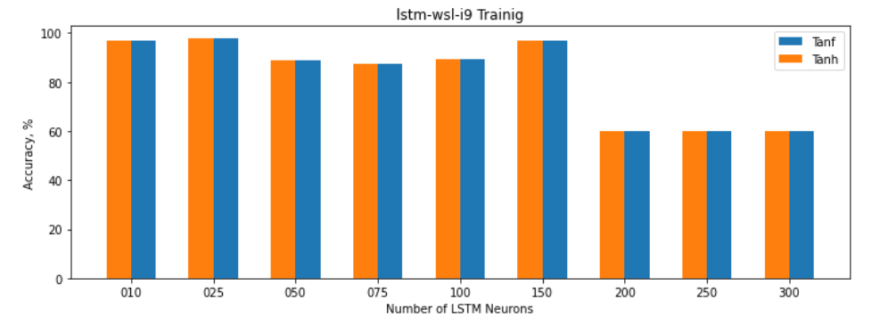

# New Activation function for ML

## A faster alternative to tanh() activation function

I present a new activation function that may improve NN performance and
reduce training time of LSTM RNN or similar networks that contain large
number of neurons using tanh() activation function. This repo contains
research materials on this new activation function.

## Motivation

-   Tanh() is the slowest (to compute) activation function used in ML.
    In LSTM neurons there are 2 independent tanh()

-   Depending on the CPU/C++ compiler implementation (usually high
    performance ML code is written in C++) tanh() maybe relatively slow,
    especially on thin clients and IoT devices

-   Reducing NN training time saves money!

-   Providing faster classification or prediction results maybe
    important in mission critical applications

-   Are there any other function's characteristics that may be beneficial
    in ML?

## Function attributes

Here I compare the above activation function with tanh() and softplus()
activation functions used in many ML packages such as Tensorflow, Torch
and others.

Below: tanh() -- BLUE, f() -- RED, softplus() -- GREEN.

### Function

### Derivative
 or 

### Integral

## Performance Analysis

See notebooks in the repo. For example, below is the chart of a small
LSTM NN training and prediction performance improvement when using the
new activation function instead of tanh(). Network size between 10 and
300 LSTM neurons doing multivariant weather prediction.

Note that the accuracy with the same hyperparameters is practically not
affected.

## What's in this repo

This repo contains research resources and test apps. Try running test apps on 
your computer and record test results.

### math-bench

Simple app to measure performance of different math functions. 

#### Linux/WSL and MAC OS

To build and run the test execute `math-bench/test.sh`

* Xcode command-line tools is required to compile this app.

#### Windows 

Open `math-bench\math-bench.sln` file with Visual Studio 2022. Run the solution.

* Microsoft Visual Studio 2022 Community edition or better is required.

### lstm-basic-test

Very simple native (C++) LSTM network performance test. This is Up to 300 LSTM neurons, 
single layer multivariate weather predictor network.

#### Linux/WSL and MAC OS

To build and run the test execute `lstm-basic-test/test.sh`

* Xcode command-line tools is required to compile this app.

#### Windows 

Open `lstm-basic-test\lstm-basic-test.sln` file with Visual Studio 2022. Run the solution.

* Microsoft Visual Studio 2022 Community edition or better is required.

### Visualize Results

Use provided jupyter notebooks to visualize results.

* Python 3.8 with Tensorflow 2.7 or later is required 
* To visualize `math-bench` results, open `performance_charts.ipynb`
* To visualize `lstm-basic-test` results, open `lstm-stats.ipynb`

## Next Steps / TODO

-   Name this function!

-   Natively (C++!) Add new activation function to a commonly used ML
    package such as Torch or Tensorflow and replace tanh() activation
    with it in LSTM neuron by default (others?)

    -   Performance tests must be done natively

-   Test the new activation function with various networks. Try
    different network sizes and hyperparameters

    -   Research only networks that contain large number of tanh()
        activations

-   Test accuracy when using new activation function and compare results
    to same networks using tanh()

    -   This maybe done in python or other scripting language

-   Test on CPU and GPU

-   Besides computational performance, explore any other potential benefits 
    of using this function

-   Besides LSTM networks, explore other types of NN where tanh() is heavily 
    used

    -   Maybe new types of networks/neurons using this activation function?

- **TBD**
