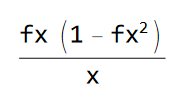

# LSTM networks optimization for embedded Devices

## ISRU - a faster alternative to tanh() activation function

Note: herein *isru()* sometimes is also referenced as *tanf()*

I present a new activation function that may improve NN performance and
reduce training time of LSTM RNN or similar networks that contain large
number of neurons using tanh() activation function. This repo contains
research materials on this new activation function. To my knowledge this 
function was briefly mentioned in the 

paper is known as *inverse square root unit (ISRU)*.
Origin of this ISRU function in my research can be found in the included 
in this repo  notebook.

## Motivation

-   Tanh() is the slowest (to compute) activation function used in ML.
    For example, in LSTM neurons there are 2 independent tanh()

-   Depending on the CPU/C++ compiler implementation (usually high
    performance ML code is written in C++) tanh() maybe relatively slow,
    especially on thin clients and IoT devices

-   Reducing NN training time saves money! And energy! 
    *This function is environmentally friendly!*

-   Providing even marginally faster classification or prediction results maybe
    important in mission critical applications

-   Are there any other function's characteristics that may be beneficial
    in ML applications?

-   Preliminary results show 1-2% acceleration of training, classification 
    and prediction with LSTM networks of relatively small size, while no notable 
    decrease in learning rate or accuracy was detected.

-   Expect even better results with larger LSTM RNNs

## Function attributes

Here I compare the above activation function with tanh() and softplus()
activation functions used in many ML packages such as Tensorflow, Torch
and others.

Below: **tanh() -- BLUE, f() -- RED, softplus() -- GREEN**.

### Function

### Derivative
 or 

### Integral

## Performance Analysis

See notebooks in the repo. For example, below is the chart of a small
LSTM NN training and prediction performance improvement when using the
new activation function instead of tanh(). Network size between 10 and
300 LSTM neurons doing multivariant weather prediction.

Note that the accuracy with the same hyperparameters is practically not
affected.

## What's in this repo

This repo contains research resources and test apps. Try running test apps on 
your computer and record test results.

### math-bench

Simple app to measure performance of different math functions. 

#### Linux/WSL and MAC OS

To build and run the test execute `math-bench/test.sh`

* Xcode command-line tools is required to compile this app.

#### Windows 

Open `math-bench\math-bench.sln` file with Visual Studio 2022. Run the solution.

* Microsoft Visual Studio 2022 Community edition or better is required.

### lstm-basic-test

Very simple native (C++) LSTM network performance test. This is Up to 300 LSTM neurons, 
single layer multivariate weather predictor network.

#### Linux/WSL and MAC OS

To build and run the test execute `lstm-basic-test/test.sh`

* Xcode command-line tools is required to compile this app.

#### Windows 

Open `lstm-basic-test\lstm-basic-test.sln` file with Visual Studio 2022. Run the solution.

* Microsoft Visual Studio 2022 Community edition or better is required.

### Visualize Results

Use provided jupyter notebooks to visualize results.

* Python 3.8 with Tensorflow 2.7 or later is required 
* To visualize `math-bench` results, open `performance_charts.ipynb`
* To visualize `lstm-basic-test` results, open `lstm-stats.ipynb`
* To visualize lstm network performance when using *isru()* vs *tanh()* open `lstm-net-size-analysis.ipynb`
  or `rnn-lstm-test-visualization.ipynb`.

### LSTM networks tests

See this  for more info.

### Using multithreading to improve LSTM network performance on CPU

Because weights in LSTM neurons are independent vectors within a single layer, it is possible to 
perform some computations in 5 parallel threads. This may improve calculations of forward and 
backward propagation, as well as Adam optimizer. However, due to multithreading overhead, 
this approach will, in general, only improve on nets with 100 or more neurons per layer.

To visualize stats comparing single-threaded and multi-threaded approach for
different network sizes on different CPUs, see `mt-performance.ipynb`.
